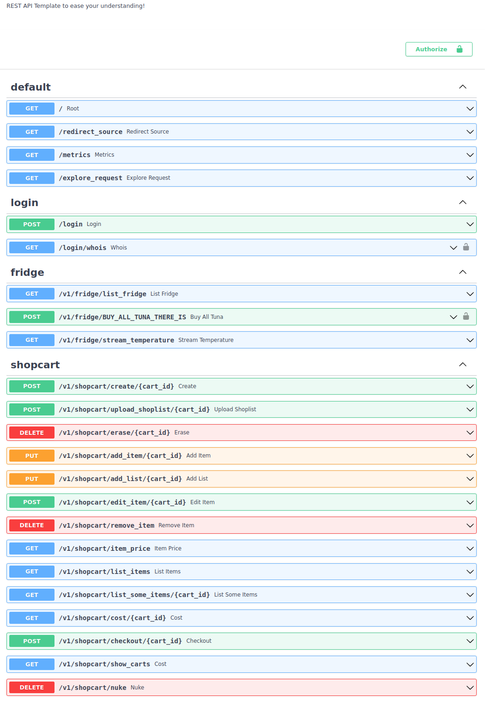
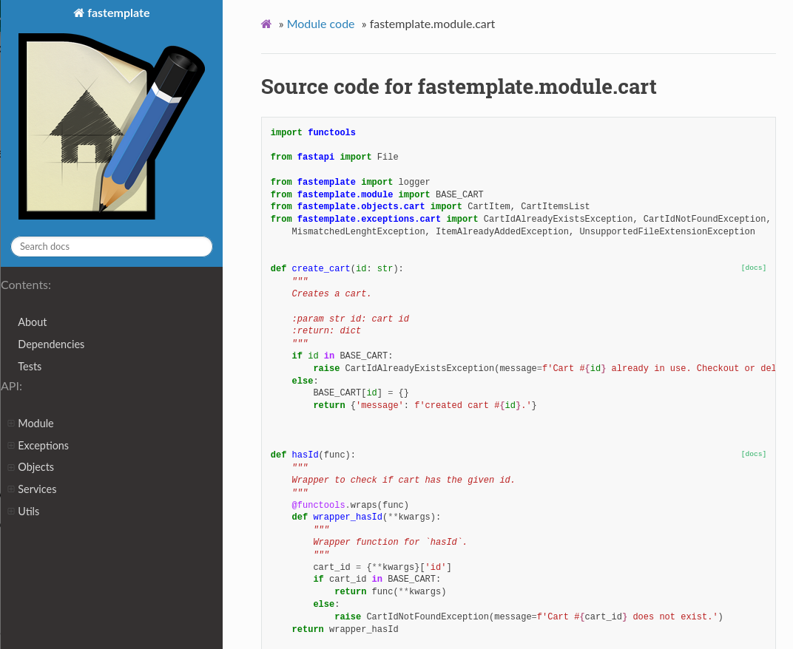

# FasTemplate

:warning: | **WORK IN PROGRESS**
:---: | :---

REST API example built using FastAPI.

I wrote this as a **follow up** after your ['Hello, wolrd'](https://fastapi.tiangolo.com/tutorial/first-steps/) app.

I recommend that you use this repo as a reading material to go along with the official User Guide ([Tutorial](https://fastapi.tiangolo.com/tutorial/) and [Advanced](https://fastapi.tiangolo.com/advanced/))

The code here already uses a lot of tools and functionalities provided by the framework, it's well documented, it has **custom exceptions**, **test cases** and python code written using good practices while it ranges from simple `for loops` to (custom) `decorators`. I believe it is good material to go along whether you are just starting or close enough to a mid level fluency in Python.

The *main* dependencies are:

- `FastAPI`: Build the actual API endpoints
- `Sphinx`: Create our poject documentation
- `Uvicorn` or `GUnicorn`: Launches our API
- `Pytest`: Run our tests

# # How to Use

- ## Clone:
```bash
git clone https://github.com/htbrandao/fastemplate.git
cd fastemplate/
```

- ## Prepare:
```
python3 -m venv venv
source venv/bin/activate
pip3 install -r requirements.txt
```

- ## Run:
    - ### Uvicorn:
        ```bash
        uvicorn fastemplate:app --host 0.0.0.0 --port 8000 --reload
        ```
    - ### Docker:
        ```
        docker build . -t fastemplate:0.0.1 # only needed once
        docker run -p 8000:8000 -n fastemplate -d fastemplate:0.0.1
        ```

- ## Use:

### Naviage to [`localhost:8000`](localhost:8000) and you will see some basic info:
```
{
    "APPLICATION":"FASTEMPLATE",
    "VERSION":"0.0.1",
    "API VERSION":"v1",
    "DOCUMENTATION":"/index.html",
    "@TIMESTAMP":"16-07-2021T11:48:31"
}
```

### To interact with the API, go to **[localhost:8000/docs](localhost:8000)**, which will look like this:



### Check out both the documentation and source code on [localhost:8000/index.html](localhost:8000/index.html) or open `docs/_build/html/index.html`:

- ## Documentation


- ## Source




- ## Post usage:

### You can and might use this as a template (or stepping stone) for **your** future projects.

### Take over eveything and make it fit your needs.

### Remember to update the **`Sphinx docs`** and your **`test cases`**!

# # TODO & FIXME:

- [ ] Improve README
- [ ] Update README images
- [ ] Docstrings
- [ ] Update docstrings (`:rtype:` and `:raises:` like in `create_cart()`)
- [ ] Update docs: make html
- [x] ~~Handle file upload~~
- [ ] Write test cases
- [ ] PyLint
- [x] Update some endpoints to `PUT` instead of `POST`
- [ ] Storytelling
